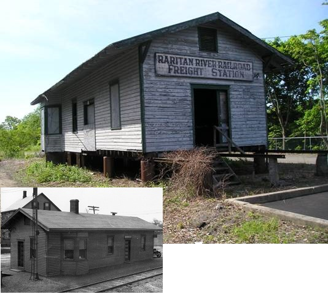

  

    

      

        

          
        

        

          <h2 style="padding-bottom: 10px">Our Mission</h2>
          

              The Raritan River Railroad Historical Society (RRRRHS) is devoted to preserving and promoting the history of the Raritan River Railroad, which operated in central New Jersey from 1888 to 1980. The society is actively involved in the preservation and restoration of the Raritan River Railroad Freight Station in Milltown, New Jersey (depicted in it's current and former state). For more information on the organization and getting involved, please see the <a href="about.html">About</a> page or contact us at <a href="mailto:RRRRHS@gmail.com"> RRRRHS@gmail.com</a>.
          

        

      

    

  

